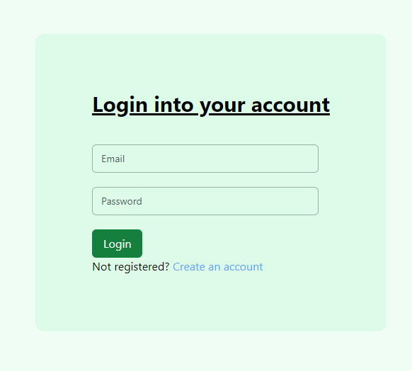
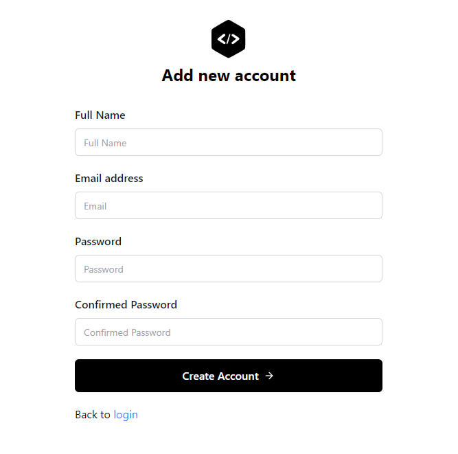
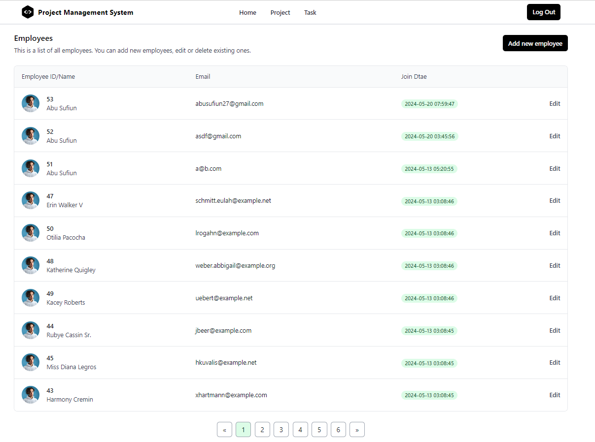
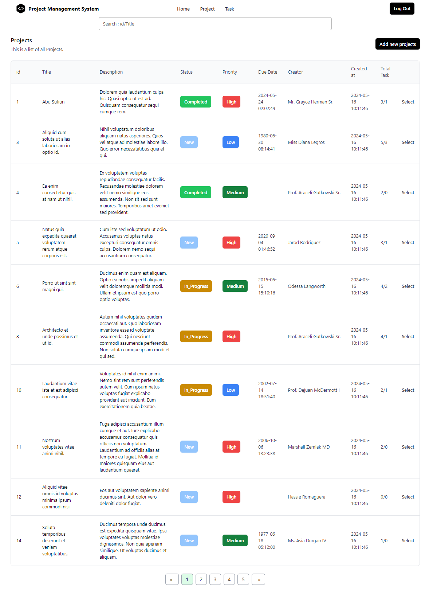
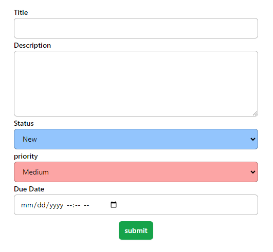
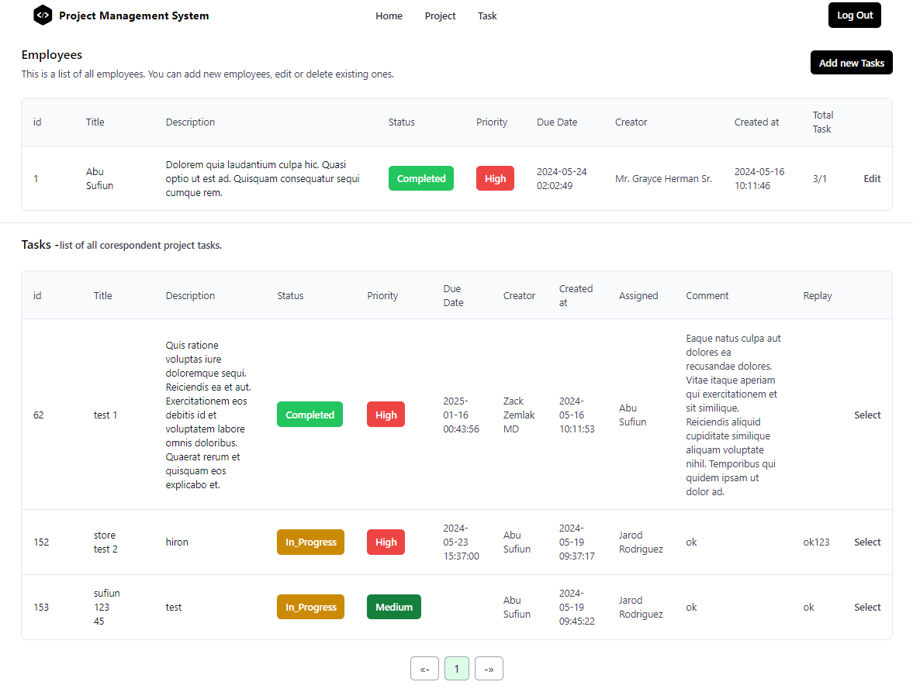
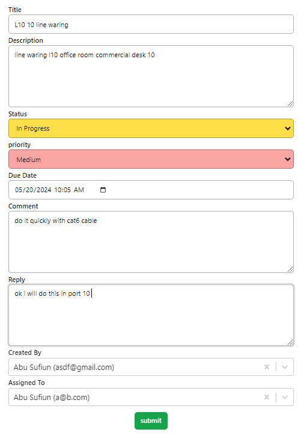
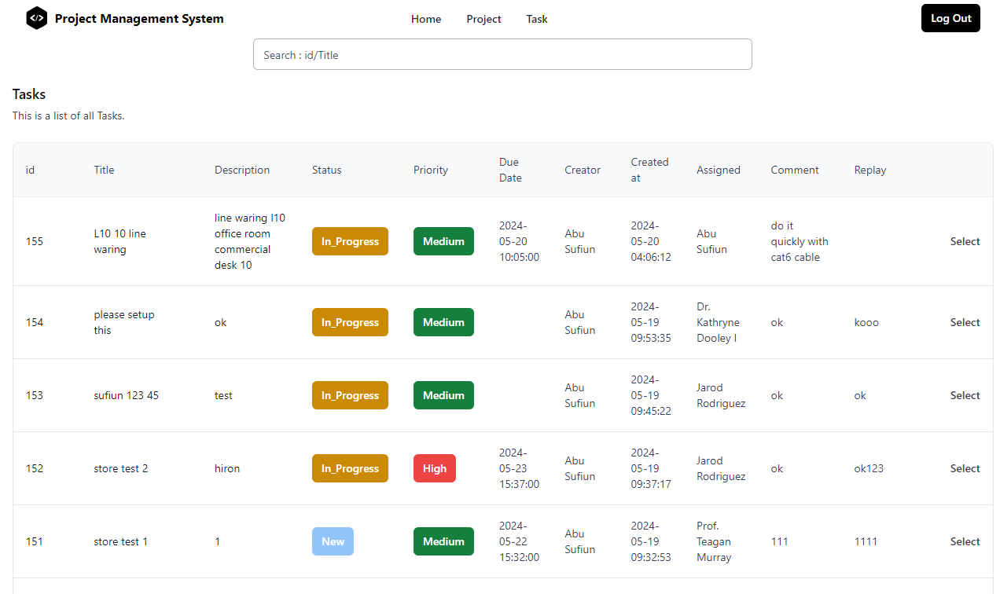

# Project Management System

This project management system utilizes React for the frontend and Laravel for the backend.

## Features

- **User Authentication**: Users can register and log in using Laravel Sanctum.
- **Project Management**: 
  - Users can create projects, and assign priority and status labels.
  - Each project can have multiple tasks.
  - Tasks can be assigned to different users.
  - The project list displays the total number of tasks and the number of completed tasks.
  - User can search project & Task also enable pagination and error handling properly for fast and smooth user experience.

## Technical Details

### Frontend
- **Technology**: React
- **Data Fetching**: Axios is used for API configuration to fetch data from the Laravel backend.

### Backend
- **Technology**: Laravel
- **Authentication**: Laravel Sanctum
- **Data Transfer**: Uses Laravel's Model Resource for API communication.

## Setup Instructions
 - clone the repository
### Frontend (React)
 - cd into the frontend react directory
    - run `npm install` to install dependencies
    - run `npm start` to start the development server
### Backend (Laravel)
 - cd into the backend laravel directory
    - run `composer install` to install dependencies
    - run `php artisan migrate` to migrate the database
    - run `php artisan db:seed` to seed the database
    - run `php artisan serve` to start the Laravel server
  
   
### Screenshots
- **Login Page**

- **Register Page**

- **Dashboard**

- **Project Page**

- **Add New Peoject**

- **Task Under a Project**

- **Add New Task**

- **Edit Task**

- **Task**


```  